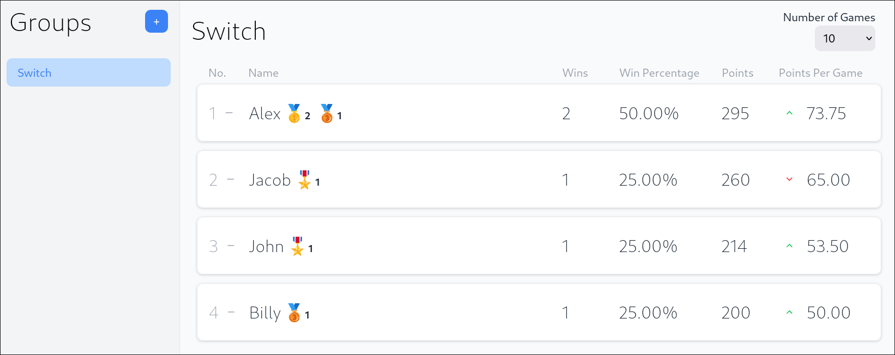
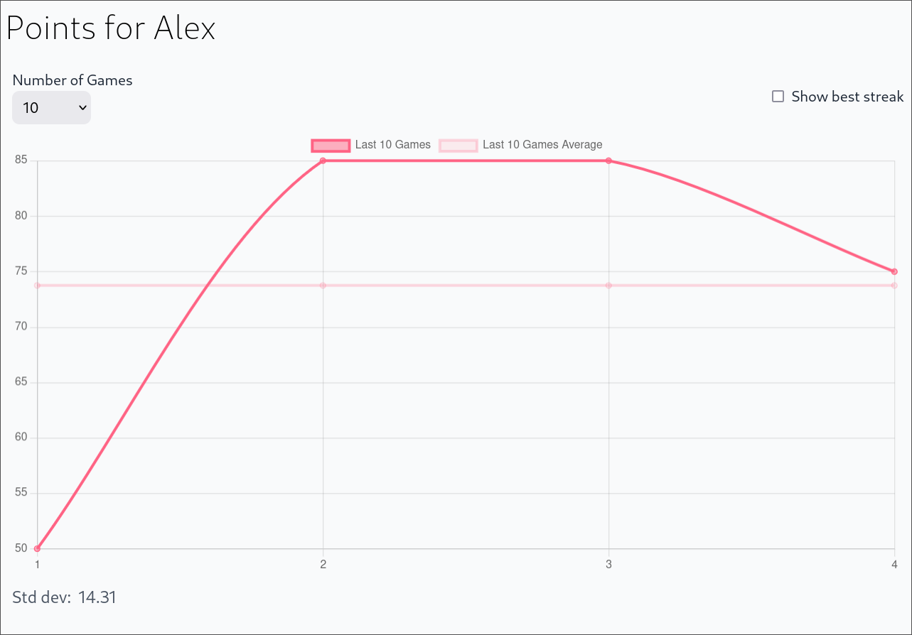
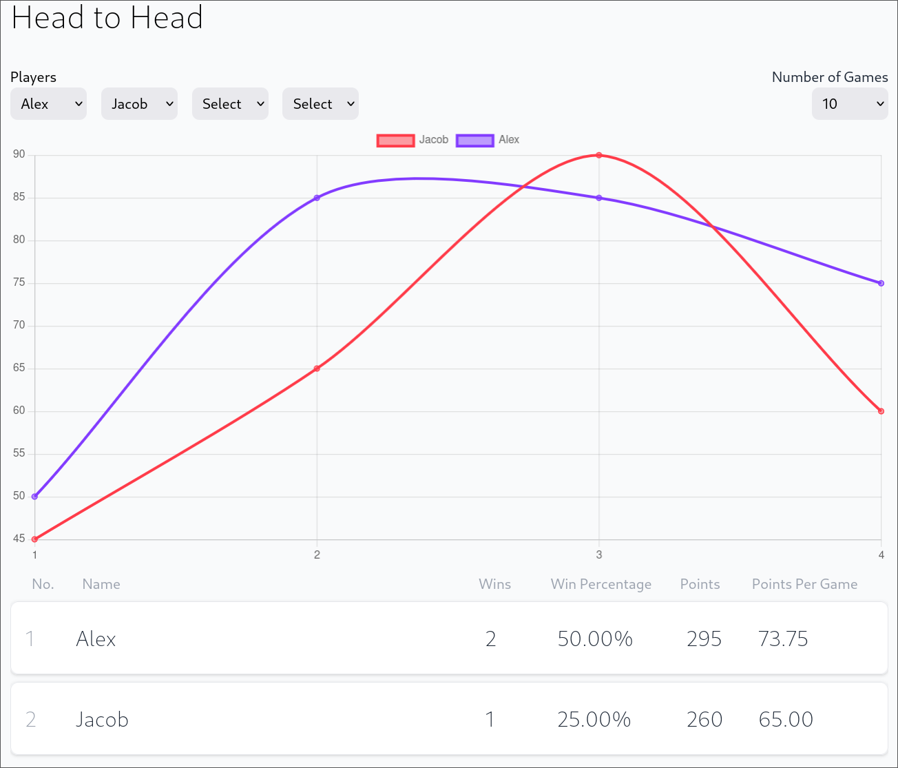
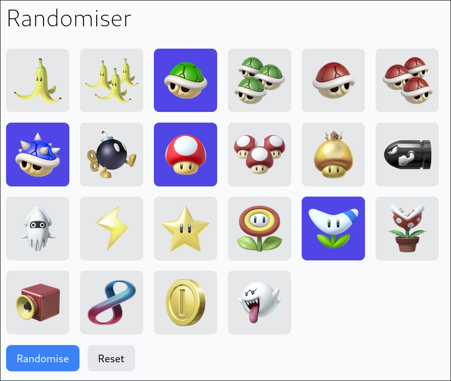

# Features
- Stats such as wins, win rate, points, points per game
- Sort the scoreboard based on any of these stats
- See change in position and points-per-game
- Medals for high scores (e.g. 🎖️ for max score)
- Have multiple groups
- Different max scores per group (e.g. 60 for 4 games, or 90 for 6 on Switch)
- View player scores as graph (along with std. deviation)
- Show a player's best streak of N games
- Head-to-head - see only the games between the chosen players (graphs + scores)
- Item randomiser (randomly pick a few items to use in "Custom Items" mode)

Scoreboard:


Player score graph:


Head-to-head:


Item randomiser:


---

# Technical Stack

- Backend: 🦀 Rust
- Frontend: React + Vite + TS
- Database: Postgres

---

# Run Locally

## Dependencies

- `sqlx-cli` (`cargo install sqlx-cli`)
- `yarn`

---

## Setup

### Environment Variables

To set up for development, copy `.env.example` to `.env` and fill it out with the development config

This also needs to be copied to `db/.env`

### Database

To set up the database, run the following commands:

```bash
# Start the DB
cd db
source <env-file>
docker-compose up -d

# Run the migrations
cd ../backend
sqlx migrate run
```

You will then need to manually create players and groups in the database. Make sure to add the players to the groups using the `player_group` table

### Frontend

Install dependencies:
```bash
cd ./frontend
yarn
```

### Backend

Generate a random secret for validating JWTs:
```bash
dd if=/dev/urandom bs=256 count=1 2>/dev/null > ./backend/src/api/jwt_secret.dat
```

---

## Running

Run the database:
```bash
cd db
docker-compose up -d
```

Run the backend:
```bash
cd backend
cargo run --bin api # Or use `cargo watch -x 'run --bin api'` to rebuild/run on file changes
```

Run the frontend:
```bash
cd frontend
yarn dev
```

Go to `http://localhost:5173`

---

## Admin Users

Admin users are required to be able to make any modifications (add games, players, groups etc.)

Admin players are created manually by adding an entry to the `admin_user` table in the database. To generate, the password hash, run `cargo run --bin tools` and enter your password. It will spit out the hash that you can add to the database


You can log in as an admin user in "Settings" on the frontend
